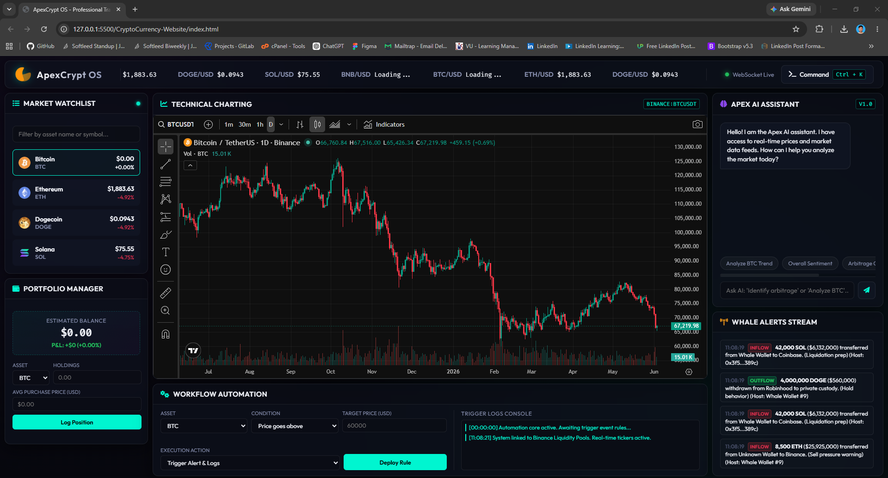

# ApexCrypt OS 🌌



**ApexCrypt OS** is a premium, professional-grade cryptocurrency trading terminal built entirely with pure HTML, CSS, and Vanilla JavaScript. It transforms a standard price-tracking website into a high-fidelity, interactive dashboard equipped with real-time market data, advanced charting, and automated trading workflows.

## ✨ Features

- **Live WebSocket Tickers**: Sub-second price updates powered by the public Binance WebSocket streams for BTC, ETH, DOGE, SOL, and BNB. Watch prices flash neon green or red in real-time.
- **Glassmorphic Cyber-Noir UI**: A stunning, desktop-first dark mode dashboard utilizing custom CSS variables, responsive grid systems, and sleek micro-animations.
- **Advanced Technical Charting**: Native integration of the TradingView widget for professional candlestick analysis and drawing tools.
- **Portfolio Ledger Manager**: A client-side portfolio tracker that securely stores your holdings in `localStorage`, calculating average entry costs and computing live P&L.
- **Apex AI Assistant (Simulation)**: A sleek interactive chatbot interface equipped with preset queries to generate mock technical analyses, sentiment checks, and cross-exchange arbitrage reports.
- **Workflow Automation Builder**: A visual "If-This-Then-That" rule engine allowing you to set price target alerts and log execution events in a live trigger console.
- **Whale Alert Stream**: A scrolling terminal console simulating large block transactions and exchange transfers in real time.
- **Global Command Palette**: Navigate the entire terminal instantly using your keyboard. Press `Ctrl + K` to summon the command search overlay.

## 🚀 Getting Started

Since this project relies on a pure client-side architecture with no backend servers, running the terminal is incredibly simple:

1. Clone or download this repository.
2. Ensure you have the `images/` directory containing the logos.
3. Open `index.html` in any modern web browser (Chrome, Firefox, Edge, Safari).
4. *No installation or build steps required!* The dashboard will automatically connect to the Binance WebSocket feeds and load the TradingView widgets.

## 🛠️ Technology Stack

- **Structure**: HTML5
- **Styling**: Vanilla CSS3 (CSS Grid, Flexbox, Custom Variables, Glassmorphism)
- **Logic**: Vanilla JavaScript (ES6+)
- **Data Feeds**: Binance Public WebSockets (`wss://stream.binance.com:9443`)
- **Charting**: TradingView Embed JS Widget
- **Icons**: FontAwesome 6

## 📂 Project Structure

```text
CryptoCurrency-Website/
├── images/             # Logos and coin assets
├── index.html          # Main terminal dashboard layout and layout structure
├── style.css           # Cyber-noir styling, animations, and CSS variables
├── script.js           # WebSocket, Portfolio, AI, and App logic
└── README.md           # Project documentation
```

## 💡 Usage Guide

- **Switching Charts**: Click on any asset row in the "Market Watchlist" panel to instantly load its corresponding TradingView chart.
- **Logging Trades**: Use the Portfolio Manager form to input your holdings. Watch your P&L update in real time as the WebSocket ticks arrive!
- **Setting Alerts**: Use the Workflow Automation panel to set a target price condition for an asset. Check the Trigger Logs console when the price crosses your target.
- **Keyboard Shortcuts**: Press `Ctrl + K` to open the command palette. Use it to quickly switch charts or run AI analysis queries.

## 📝 License

This project is open-source and available under the MIT License.
